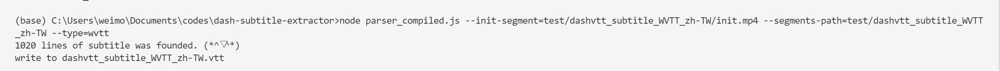
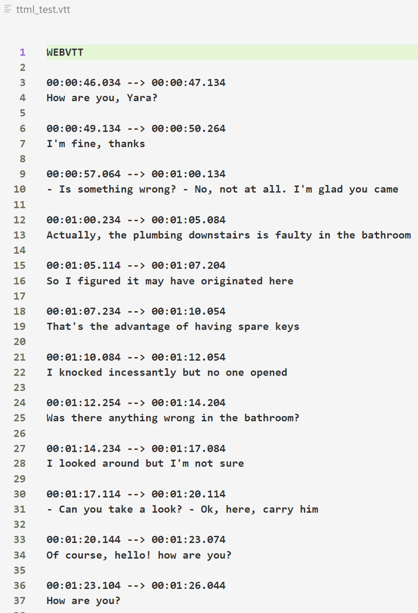

# dash subtitle extractor

Ttranslated from shaka-player project by xhlove.

# node本地移植版

参考[移植shaka-player字幕解析部分为本地程序](移植shaka-player字幕解析部分为本地程序.md)

目前完成了demo，适配ing

如果自行修改了`parser.js`，那么记得重新编译下，编译前的配置参考上面的移植文档

```bash
npx google-closure-compiler --js parser.js --js shaka/**/*.js --js=node_modules/xmldom/**/*.js --js=node_modules/google-closure-library/**/*.js --js=!**/goog/asserts/asserts.js --dependency_mode=PRUNE --entry_point=goog:parser --js_output_file=parser_compiled.js
```

使用命令

```bash
node parser_compiled.js --init-segment=test/dashvtt_subtitle_WVTT_zh-TW/init.mp4 --segments-path=test/dashvtt_subtitle_WVTT_zh-TW --type=wvtt

node parser_compiled.js --init-segment=test/ttml_test/000.mp4 --segments-path=test/ttml_test --type=ttml

node parser_compiled.js --segments-path=test/ismttml_text_TTML_pol --type=ttml
```

- **路径参数请不要使用反斜杠**
- **参数后面必须跟=**
- --init-segment 是init文件的路径 对于TTML该选项不是必要的
- --segments-path 是分段文件所在的路径
- --type 指定字幕类型 wvtt ttml 二选一
- --debug 可以输出一些debug信息

如果要用测试命令记得解压`dashvtt_subtitle_WVTT_zh-TW.zip`和`ttml_test.zip`

- wvtt



- ttml



# requirements

> pip install argparse

# usage

```bash
usage: python -m pyshaka.main [OPTION]...

A tool that to parse subtitle embedded in DASH stream

optional arguments:
  -h, --help            show this help message and exit
  -debug, --debug       debug is needed
  -init-path INIT_PATH, --init-path INIT_PATH
                        init segment path
  -segments-path SEGMENTS_PATH, --segments-path SEGMENTS_PATH
                        segments folder path
  -segment-time SEGMENT_TIME, --segment-time SEGMENT_TIME
                        usually needed for ttml content, calculation method: d / timescale
```

e.g.

```bash
python -m pyshaka.main --init-path "test/dashvtt_subtitle_WVTT_zh-TW/init.mp4" --segments-path "test/dashvtt_subtitle_WVTT_zh-TW"
```