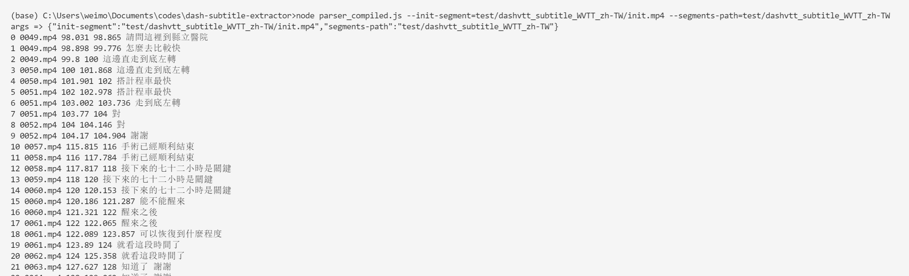

# dash mp4 vtt extractor

Ttranslated from shaka-player project by xhlove.

# node本地移植版

参考[移植shaka-player字幕解析部分为本地程序](移植shaka-player字幕解析部分为本地程序.md)

目前完成了demo，适配ing

如果自行修改了`parser.js`，那么记得重新编译下，编译前的配置参考上面的移植文档

```bash
npx google-closure-compiler --js parser.js --js shaka/**/*.js --js=node_modules/xmldom/**/*.js --js=node_modules/google-closure-library/**/*.js --js=!**/goog/asserts/asserts.js --dependency_mode=PRUNE --entry_point=goog:parser --js_output_file=parser_compiled.js
```

使用命令

```bash
node parser_compiled.js --init-segment=test/dashvtt_subtitle_WVTT_zh-TW/init.mp4 --segments-path=test/dashvtt_subtitle_WVTT_zh-TW
```

- **路径参数请不要使用反斜杠**
- **参数后面必须跟=**
- --init-segment 是init文件的路径
- --segments-path 是分段文件所在的路径

如果要用测试命令记得解压`dashvtt_subtitle_WVTT_zh-TW.zip`

目前完成基本信息打印，转换为vtt以及适配ttml等适配ing



# requirements

> pip install argparse

# usage

```bash
usage: dash mp4 vtt extractor v1.1@xhlove [-h] [-p PATH]

Dash Mp4 VTT Subtitle Extractor, which is translated from shaka-player project
by xhlove. Report bug to vvtoolbox.dev@gmail.com

optional arguments:
  -h, --help            show this help message and exit
  -p PATH, --path PATH  dash mp4 folder path
```

# output

