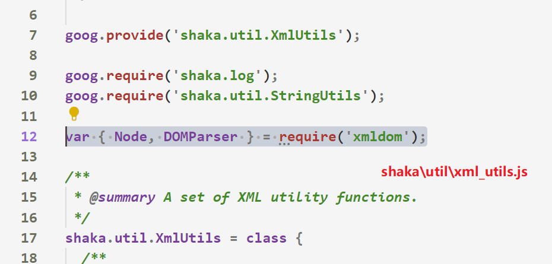
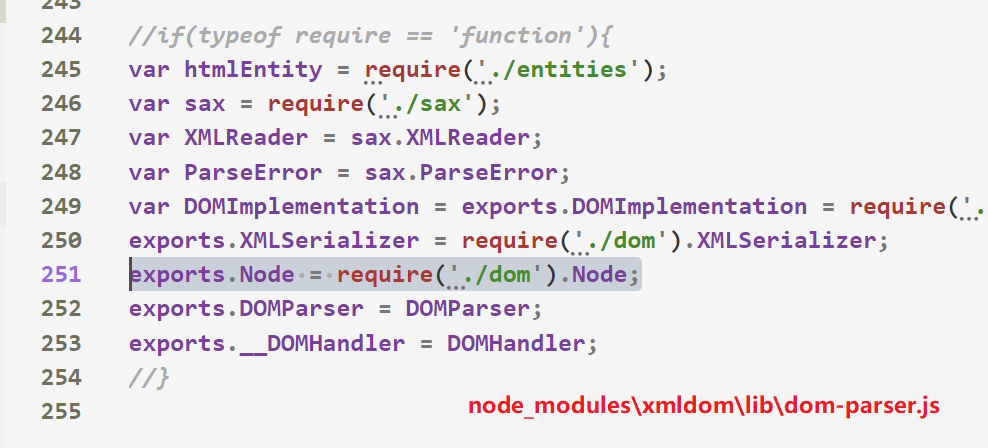
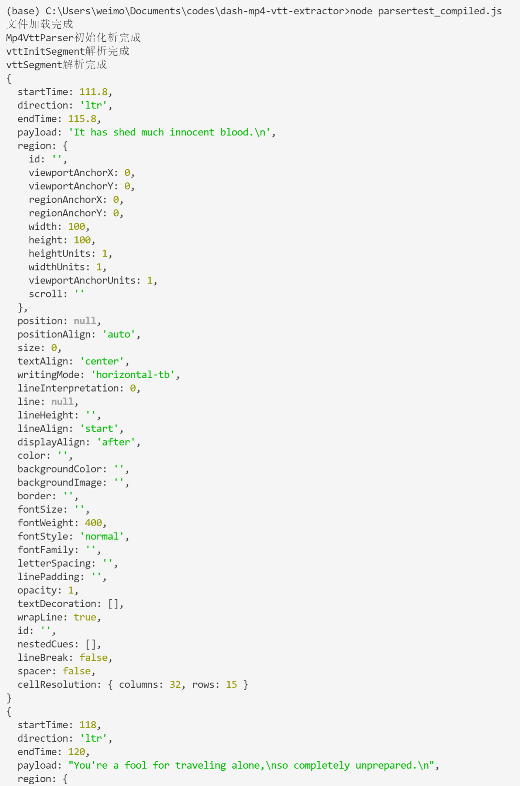

# 前言

目前[shaka-packager](https://github.com/google/shaka-packager)并不支持`dash mp4内嵌字幕`转回文本字幕

之前从[shaka-player](https://github.com/google/shaka-player)翻译了部分代码，实现了dash mp4内嵌vtt的解析，不过不太完善

于是决定直接从shaka-player里面把解析部分单独拿出来

- https://github.com/google/shaka-player

# 步骤

首先下载shaka-player的源代码，github直接下载zip就可以了

然后将`lib`文件夹解压，重命名为`shaka`

通过简单阅读源代码，可以发现代码中大量使用`goog.provide`和`goog.require`

我们需要知道的是该项目使用了`google-closure-library`这个库

以及使用`google-closure-compiler`进行编译，即将整个项目编译为单个js文件

接下来新建一个`parsertest.js`文件，在这个文件里面，我们通过类似的写法调用解析的方法即可

这部分可以参考[mp4_vtt_parser_unit.js](https://github.com/google/shaka-player/blob/master/test/text/mp4_vtt_parser_unit.js)

更多官方案例（PS 大多数时候看官方的测试用例可以学到很多东西）

- https://github.com/google/shaka-player/blob/master/test/text

这里简化了下，最终代码如下

```javascript
goog.module('parser');

require("google-closure-library");
goog.require("shaka.text.Mp4VttParser");
const fs = require("fs");

try {
    const vttInitSegment = new Uint8Array(fs.readFileSync("test/assets/vtt-init.mp4"));
    const vttSegment = new Uint8Array(fs.readFileSync("test/assets/vtt-segment.mp4"));
    console.log("文件加载完成");
    const parser = new shaka.text.Mp4VttParser();
    console.log("Mp4VttParser初始化析完成");
    parser.parseInit(vttInitSegment);
    console.log("vttInitSegment解析完成");
    const time = {periodStart: 0, segmentStart: 0, segmentEnd: 0};
    const result = parser.parseMedia(vttSegment, time);
    console.log("vttSegment解析完成");
    for (let i = 0; i < result.length; i++){
        console.log(result[i]);
    }
} catch (err) {
    console.trace(err);
}
```

这里读取了本地文件，将`shaka-player`用的测试文件复制过来即可

这里直接弄好了，路径是`test/assets/vtt-init.mp4`和`test/assets/vtt-segment.mp4`

现在代码是没办法直接运行的，因为node不认识`goog.xxx`

所以要使用`google-closure-compiler`将全部js编译成一个js

第一步执行`npm install`命令

第二步将`shaka/debug/log.js`里面的`window.console && window.console.log.bind`改为`true`

因为node没有`window`

第三步在`shaka/util/xml_utils.js`的`class`之前，也就是`shaka.util.XmlUtils = class`前面加一句

- `var { Node, DOMParser } = require('xmldom');`



第四步在`node_modules/xmldom/lib/dom-parser.js`末尾导出的地方加一句



- `exports.Node = require('./dom').Node;`

然后执行下面的命令编译为一个单独的js

有兴趣可以参考`closure-library`官方文档，看看`hello world`的整体过程

- `https://google.github.io/closure-library/develop/get-started`

命令如下

```bash
npx google-closure-compiler --js parsertest.js --js shaka/**/*.js --js=node_modules/xmldom/**/*.js --js=node_modules/google-closure-library/**/*.js --js=!**/goog/asserts/asserts.js --dependency_mode=PRUNE --entry_point=goog:parser --js_output_file=parsertest_compiled.js
```

具体可以通过`npx google-closure-compiler --help`查看详细说明

简单解释一下

- `--js` 后面接要一起编译的js文件
    - 可以是单个文件
    - 可以是`xx/*.js`或者`xx/**/*.js`这样的通配符表示
    - 最前面加一个`!`表示排除
- `--dependency_mode` 表示编译的模式
    - `PRUNE` 表示根据`--entry_point`设定的文件，然后只导入需要的依赖，这很重要，不然会把很多用不到的也编译了，然后出现很多找不到`window`的报错（被坑了很久）
- `--entry_point` 入口点，姑且理解为主程序入口吧
- `--js_output_file` 最终输出文件

注意命令中的`=`不是必须的

现在可以执行`node parsertest_compiled.js`命令测试了



解析正常~